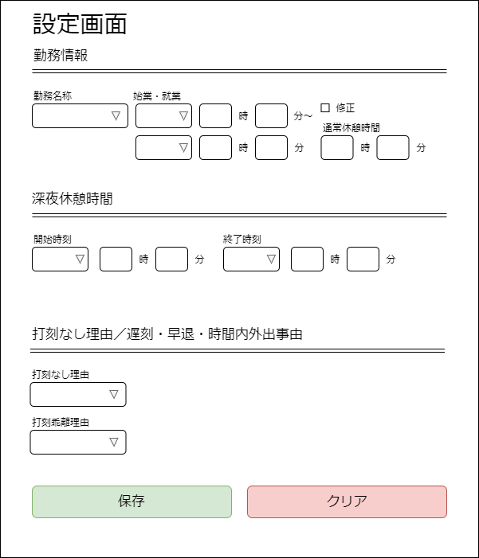

# 基本設計書

## 画面設計

### 設定画面

自動で入力させたい勤怠情報を設定する画面。

## 機能設計

### 01.勤怠情報設定を保存

+ 処理内容
+ 必要なデータ
+ 取得元
+ ユーザ操作

### 02.勤怠情報設定のクリア

+ 処理内容
+ 必要なデータ
+ 取得元
+ ユーザ操作

### 03.勤怠情報の自動入力

+ 処理内容
+ 必要なデータ
+ 取得元
+ ユーザ操作

## データ設計

| データ名             | ID            | 備考 |
|:---------------------|:--------------|:-----|
|勤務名称              |KNMCDS         |      |
|始業日                |KNMTMRNGSTD    |      |
|始業時刻(時)          |KNMTMRNGSTH    |      |
|始業時刻(分)          |KNMTMRNGSTM    |      |
|終業日                |KNMTMRNGETD    |      |
|終業時刻(時)          |KNMTMRNGETH    |      |
|終業時刻(分)          |KNMTMRNGETM    |      |
|休憩時間修正          |RTTLCHKBX56    |      |
|休憩時間(時)          |RTTLVAL56H     |      |
|休憩時間(分)          |RTTLVAL56M     |      |
|深夜休憩開始日        |GI_TIME50_Seq0D|      |
|深夜休憩開始時刻(時)  |GI_TIME50_Seq0H|      |
|深夜休憩開始時刻(分)  |GI_TIME50_Seq0M|      |
|深夜休憩日終了日      |GI_TIME50_Seq0D|      |
|深夜休憩開終了時刻(時)|GI_TIME51_Seq0H|      |
|深夜休憩開終了時刻(分)|GI_TIME51_Seq0M|      |
|打刻なし理由          |SGYCD1S        |      |
|打刻乖離理由          |SGYCD2S        |      |
|次へボタン            |btnNext1       |      |
|保存ボタン            |dSave0         |      |
|入力完了ボタン        |dSubmission0   |      |
