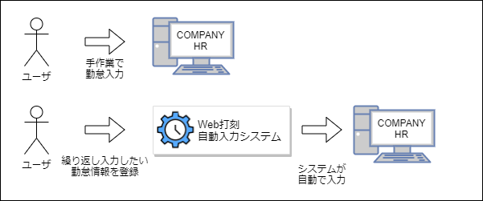
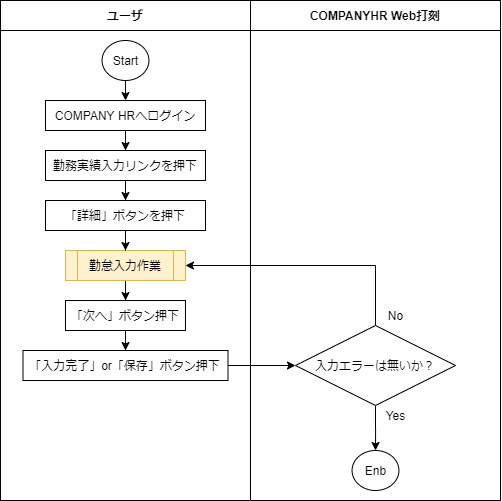
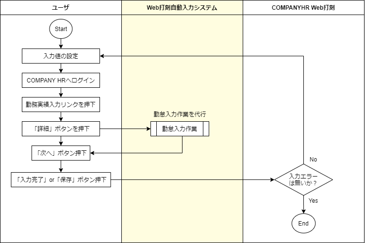

# 要件定義書

本ドキュメントは、「Web打刻自動入力システム」についての要件定義を行う。

## 目次

- [要件定義書](#要件定義書)
  - [目次](#目次)
  - [1. 目的・方針](#1-目的方針)
  - [2. Web打刻自動入力システムの概要](#2-web打刻自動入力システムの概要)
  - [3. 現状の業務フロー](#3-現状の業務フロー)
  - [4. 現状の課題について](#4-現状の課題について)
  - [5. どのように課題を解決するか](#5-どのように課題を解決するか)
  - [6. 本システム導入後の業務フロー](#6-本システム導入後の業務フロー)
  - [7. 本システムの機能要件](#7-本システムの機能要件)
  - [8. 本システムで実現しないこと](#8-本システムで実現しないこと)
  - [9. 開発ツールおよび環境について](#9-開発ツールおよび環境について)
    - [9-1. 動作環境](#9-1-動作環境)
    - [9-2. GoogleChrome拡張コンポーネント](#9-2-googlechrome拡張コンポーネント)
    - [9-3. WebStorage API(LocalStorage)](#9-3-webstorage-apilocalstorage)
    - [9-4. jQuery 3.5.1](#9-4-jquery-351)
    - [9-5. SPECTRE.CSS](#9-5-spectrecss)

## 1. 目的・方針

- 日々の勤怠入力作業の効率化を図る。
- 説明書を読まなくても使いやすいと感じる直感的なユーザーインターフェイスを目指す。

## 2. Web打刻自動入力システムの概要

本システム「Web打刻自動入力システム」は、弊社社員が日々実施する「勤怠入力作業」を自動化するシステムである。  

## 3. 現状の業務フロー

## 4. 現状の課題について

現状の課題として、毎日同じ勤怠情報を入力する場合、同じ情報を繰り返し入力する必要があり、  
その都度同じ内容のマウス操作やキーボード操作が発生する。  

たとえば、休憩時間が「45分」の現場の場合「勤務実績入力画面」では、デフォルトの休憩時間が「1時間」と設定されているため、  
勤怠を入力するたびに「通常休憩時間」の修正チェックボックスにチェックを付け「45分」と入力する作業が発生する。

勤怠入力の度に、同じ入力を実施しなければならないのは非効率であり、さらに「入力忘れ・誤入力」といった問題を引き起こす可能性がある。

## 5. どのように課題を解決するか

本システムを開発することにより、上記問題の解決を図る。  

具体的な方法としては、あらかじめ「繰り返し入力が必要な値」をユーザが本システムに設定し、  
「勤務実績入力画面」を開いた際に本システムが設定しておいた値を自動で入力する。

このことにより、ユーザは「勤怠情報を入力する作業」を省略することが可能になり、「次へ」ボタンと「入力完了」ボタンを押下するだけで勤怠入力が完了する。

以上のことから、本システムを使用することにより問題の解決および、  
「勤怠入力作業の効率化」、「入力忘れ・誤入力の防止」といった効果が期待できる。

## 6. 本システム導入後の業務フロー

## 7. 本システムの機能要件

|No |機能                                  |詳細                                                                            |
|:-:|:-------------------------------------|:-------------------------------------------------------------------------------|
| 1 |勤怠自動入力機能                      |勤務実績入力画面にて「詳細」ボタンを押下した時、あらかじめユーザーが本システムに設定しておいた値を各フォームへ自動で入力する。|
| 2 |自動入力値の設定保存機能              |本システムに自動で入力させたい値をあらかじめユーザが設定し、その値をブラウザへ保存する。|
| 3 |自動入力値の設定クリア機能            |ユーザがブラウザへ設定した値を任意のタイミングで削除する。|
| 4 |自動入力の有効化・無効化の切り替え機能|本システムからの自動入力を有効化／無効化する。|

## 8. 本システムで実現しないこと

- GoogleChrome以外のインターネットブラウザでの動作
- 「勤務実績入力画面」→「次へ」ボタンの自動押下
  - 誤入力防止のため

- 「勤務実績入力画面」→「入力完了」ボタンの自動押下
  - 誤入力防止のため
- 「勤務実績入力画面」→「休暇実績情報欄」の自動入力
  - 頻繁に入力する項目ではないため

## 9. 開発ツールおよび環境について

### 9-1. 動作環境

デスクトップ版GoogleChromeバージョン84以降が動作するすべてのOSで動作する　　

デスクトップ版GoogleChromeの入手先を下記に示す。

> https://www.google.com/chrome/

### 9-2. GoogleChrome拡張コンポーネント

「勤務実績入力画面」へ自動的に値を入力するにあたって、本システムにWebページへのアクセス権が必要となる。  
そのため、本システムはGoogleChromeの拡張コンポーネントを使用し「GoogleChromeの拡張機能」として実装する。  

GoogleChromeの拡張コンポーネントや機能については、下記の公式ドキュメントを参照する。  

> https://developer.chrome.com/extensions/devguide

### 9-3. WebStorage API(LocalStorage)

ユーザが繰り返し入力したい勤怠情報をブラウザへ保存する必要があるため「WebStorage API」を使用する。

「WebStorage API」の取り扱いについては、下記のドキュメントを参照する。

> https://developer.mozilla.org/en-US/docs/Web/API/Web_Storage_API

### 9-4. jQuery 3.5.1

本システムでは多くのDOM要素を操作する必要がある。
そのため、DOM要素を簡単に取り扱うことが可能になるJavaScriptフレームワーク、「jQuery 3.5.1」を使用する。

jQueryの入手先や、取り扱いについては下記の公式ドキュメントを参照する。

> https://jquery.com/

### 9-5. SPECTRE.CSS

本システムにおける設定画面のデザインを効率よく行うため、CSSフレームワーク「SPECTRE.CSS」を使用する。

SPECTRE.CSSの入手先や、取り扱いについては下記の公式ドキュメントを参照する。

> https://picturepan2.github.io/spectre/index.html
