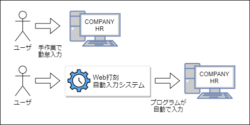

# 要件定義書

本ドキュメントは、「Web打刻自動入力システム」について要件定義を行う。

## 目次

- [要件定義書](#要件定義書)
  - [目次](#目次)
  - [1. 目的・方針](#1-目的方針)
  - [2. Web打刻自動入力システムの概要](#2-web打刻自動入力システムの概要)
  - [3. 開発ツールおよび環境について](#3-開発ツールおよび環境について)
    - [3-1. 動作環境](#3-1-動作環境)
    - [3-2. GoogleChrome拡張コンポーネント](#3-2-googlechrome拡張コンポーネント)
    - [3-3. jQuery 3.5.1](#3-3-jquery-351)
    - [3-4. SPECTRE.CSS](#3-4-spectrecss)
  - [4. Web打刻自動入力システムの機能要件](#4-web打刻自動入力システムの機能要件)
  - [5. 現状の業務フロー](#5-現状の業務フロー)
  - [6. 現状の課題について](#6-現状の課題について)
  - [7. どのように課題を解決するか](#7-どのように課題を解決するか)
  - [8. Web打刻自動入力システム導入後の業務フロー](#8-web打刻自動入力システム導入後の業務フロー)
  - [9. Web打刻自動入力システムで実現しないこと](#9-web打刻自動入力システムで実現しないこと)
  - [10. 用語集](#10-用語集)

## 1. 目的・方針

- 社内研修を通して、新言語の習得を目指す。
- 日々の勤怠入力作業の効率化を図る。
- 説明書を読まなくても使える直感的なユーザーインターフェイスを目指す。

## 2. Web打刻自動入力システムの概要

本システム「Web打刻自動入力システム」は、弊社社員が日々実施する「勤怠入力作業」をスクリプトよって自動化するシステムである。  

## 3. 開発ツールおよび環境について

### 3-1. 動作環境

デスクトップ版Google Chromeバージョン84以降が動作するすべてのOSで動作する　　

デスクトップ版Google Chromeの入手先を下記に示す。

> https://www.google.com/chrome/

### 3-2. GoogleChrome拡張コンポーネント

「COMPANYHRの勤怠入力画面」へ自動的に値を入力するにあたって、本システムにWebページへのアクセス権が必要となる。  
そのため、本システムはGoogleChromeの拡張コンポーネントを使用し、「GoogleChromeの拡張機能」として実装する。  

GoogleChromeの拡張コンポーネントや機能については、下記の公式ドキュメントを参照する。  

> https://developer.chrome.com/extensions/devguide

### 3-3. jQuery 3.5.1

本システムでは多くのDOM要素を操作する必要がある。
そのため、DOM要素を簡単に取り扱うことが可能になるJavaScriptフレームワーク、「jQuery 3.5.1」を使用する。

jQueryの入手先や、取り扱いについては下記の公式ドキュメントを参照する。

> https://jquery.com/

### 3-4. SPECTRE.CSS

本システムにおける設定画面のデザインを効率よく行うため、CSSフレームワーク「SPECTRE.CSS」を使用する。

SPECTRE.CSSの入手先や、取り扱いについては下記の公式ドキュメントを参照する。

> https://picturepan2.github.io/spectre/index.html

## 4. Web打刻自動入力システムの機能要件

|No |機能                                  |詳細                                                                            |
|:-:|:-------------------------------------|:-------------------------------------------------------------------------------|
| 1 |勤怠自動入力機能                      |COMPANY HRの勤怠入力ページに遷移した時、あらかじめユーザーが設定しておいた値を自動で入力する機能|
| 2 |自動入力値の設定保存機能              |本システムに自動で入力させたい値をあらかじめユーザが設定し、その値を保存する機能|
| 3 |自動入力値の設定クリア機能            |ユーザが設定した値をユーザが任意のタイミングで削除できる機能|
| 4 |自動入力の有効化・無効化の切り替え機能|本システムからの自動入力を有効化／無効化できる機能                              |

## 5. 現状の業務フロー

.png)

## 6. 現状の課題について

現状の課題として、毎日同じ勤怠情報を入力する場合、同じ情報を繰り返し入力する必要があり、  
その都度同じ内容のマウス操作やキーボード操作が発生する。  

たとえば、休憩時間が「45分」の現場の場合「COMPANYHRの勤怠入力画面」では、デフォルトの休憩時間が「1時間」と設定されているため、  
勤怠を入力するたびに「通常休憩時間」の修正チェックボックスにチェックを付け「45分」と入力する作業が発生する。

勤怠入力の度に、同じ入力を実施しなければならないのは非効率であり、さらに「入力忘れ・誤入力」といった問題を引き起こす可能性がある。

## 7. どのように課題を解決するか

本システムを開発することにより、上記問題の解決を図る。  

具体的な方法としては、あらかじめ「繰り返し入力が必要な値」をユーザが本システムに設定し、  
「COMPANYHRの勤怠入力画面」を開いた際に本システムが設定しておいた値を自動で入力する。

このことにより、ユーザは「勤怠情報を入力する作業」を省略することが可能になり、「次へ」ボタンと「入力完了」ボタンを押下するだけで勤怠入力が完了する。

以上のことから、Web打刻自動入力システムを使用することにより問題の解決および、  
「勤怠入力の効率化」、「入力忘れ・誤入力の防止」といった効果が期待できる。

## 8. Web打刻自動入力システム導入後の業務フロー

.png)

## 9. Web打刻自動入力システムで実現しないこと

- GoogleChromeの拡張機能が動作するブラウザ以外での動作
- 「COMPANYHRの勤怠入力画面」「次へ」ボタンの自動押下 
  - 誤入力防止のため

- 「COMPANYHRの勤怠入力画面」「入力完了」ボタンの自動押下
  - 誤入力防止のため
- 「COMPANYHRの勤怠入力画面」「休暇実績情報」の自動入力
  - 頻繁に入力する項目ではないため

## 10. 用語集

|用語|説明|
|:---|:---|
|「Web打刻自動入力システム」|
|COMPANYHRの勤怠入力画面||
|「次へ」ボタン|
|「入力完了」ボタン|
|「詳細」ボタン」|