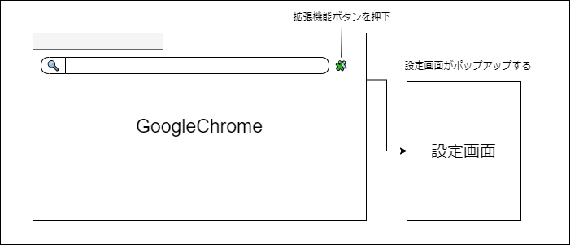
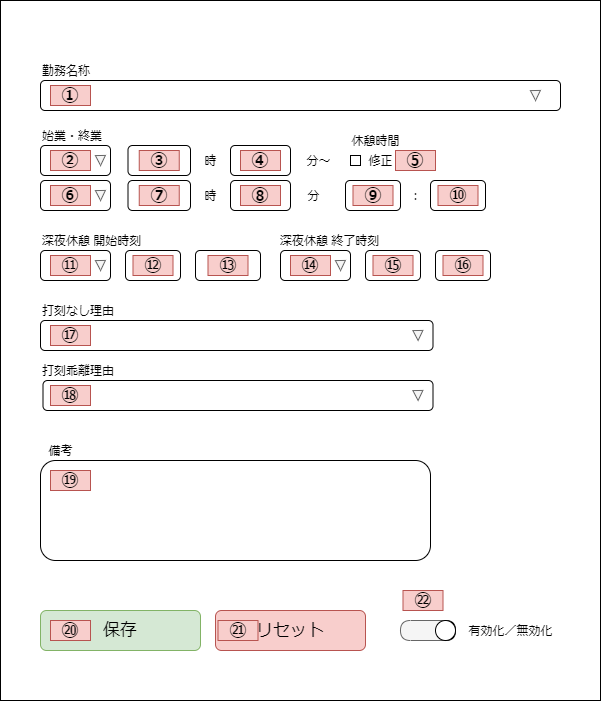
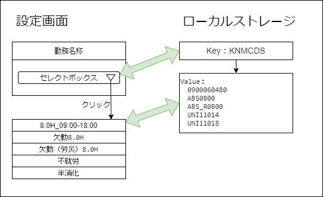
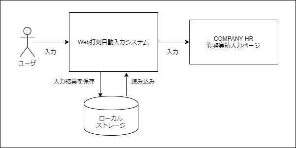

# 基本設計書

## 目次

- [基本設計書](#基本設計書)
  - [目次](#目次)
  - [1. 画面設計](#1-画面設計)
    - [1-1. 画面構成イメージ図](#1-1-画面構成イメージ図)
    - [1-2. 設定画面イメージ図](#1-2-設定画面イメージ図)
    - [1-3. 設定画面のHTMLタグと子要素](#1-3-設定画面のhtmlタグと子要素)
  - [2. データ設計](#2-データ設計)
    - [2-1. ローカルストレージ](#2-1-ローカルストレージ)
    - [2-2. ローカルストレージとDOM要素の紐づきイメージ図](#2-2-ローカルストレージとdom要素の紐づきイメージ図)
    - [2-3. ローカルストレージのデータ構造](#2-3-ローカルストレージのデータ構造)
  - [2-4. データフロー](#2-4-データフロー)
  - [3. 機能設計](#3-機能設計)
    - [3-1. 自動入力機能](#3-1-自動入力機能)
    - [3-2. 自動入力値の設定保存機能](#3-2-自動入力値の設定保存機能)
    - [3-3. 自動入力値の設定クリア機能](#3-3-自動入力値の設定クリア機能)
    - [3-4. 自動入力の有効化・無効化の切り替え機能](#3-4-自動入力の有効化無効化の切り替え機能)


## 1. 画面設計

GoogleChromeの画面右上辺りには、パズルのピースのような拡張機能を呼び出すボタンが存在する。  
そのボタンを押下した際に本プログラムの設定画面を表示させる。

設定画面は、ユーザが本プログラムに自動入力させたい値を入力し、設定を保存する画面である。  
直感的に使用できるよう、実際の勤務実績入力画面に基づいて作成する。  

また、開

### 1-1. 画面構成イメージ図



### 1-2. 設定画面イメージ図

ポップアップさせる設定画面のイメージ図を下記に示す。



### 1-3. 設定画面のHTMLタグと子要素

それぞれの要素は、HTMLのformタグから構成される。
以下に設定画面参考図とNoを紐づけた表を下記に示す。

<details><summary>HTMLタグと子要素の表</summary>


|No |HTMLタグ          |子要素                   |
|:-:|:-----------------|:------------------------|
|1  |セレクトボックス  |8.0H_09:00-18:00         |
|   |                  |欠勤8.0H                 |
|   |                  |欠勤（労災）8.0H         |
|   |                  |不就労                   |
|   |                  |半消化                   |
|2  |セレクトボックス  |前日                     |
|   |                  |当日                     |
|   |                  |翌日                     |
|3  |テキストボックス  |                         |
|4  |テキストボックス  |                         |
|5  |チェックボックス  |                         |
|6  |セレクトボックス  |前日                     |
|   |                  |当日                     |
|   |                  |翌日                     |
|7  |テキストボックス  |                         |
|8  |テキストボックス  |                         |
|9  |テキストボックス  |                         |
|10 |テキストボックス  |                         |
|11 |セレクトボックス  |前日                     |
|   |                  |当日                     |
|   |                  |翌日                     |
|   |                  |--                       |
|12 |セレクトボックス  |00                       |
|   |                  |01                       |
|   |                  |02                       |
|   |                  |03                       |
|   |                  |︙（※省略）              |
|   |                  |22                       |
|   |                  |23                       |
|   |                  |--                       |
|13 |セレクトボックス  |00                       |
|   |                  |05                       |
|   |                  |10                       |
|   |                  |︙（※省略）              |
|   |                  |50                       |
|   |                  |55                       |
|   |                  |--                       |
|14 |セレクトボックス  |前日                     |
|   |                  |当日                     |
|   |                  |翌日                     |
|   |                  |--                       |
|15 |セレクトボックス  |00                       |
|   |                  |01                       |
|   |                  |02                       |
|   |                  |03                       |
|   |                  |︙（※省略）              |
|   |                  |22                       |
|   |                  |23                       |
|   |                  |--                       |
|16 |セレクトボックス  |00                       |
|   |                  |05                       |
|   |                  |10                       |
|   |                  |︙（※省略）              |
|   |                  |50                       |
|   |                  |55                       |
|   |                  |--                       |
|17 |セレクトボックス  |---------[選 択]---------|
|   |                  |出勤時打刻漏れ           |
|   |                  |退勤時打刻漏れ           |
|   |                  |出・退勤時打刻漏れ       |
|   |                  |直行・直帰               |
|   |                  |直行                     |
|   |                  |直帰                     |
|   |                  |出張                     |
|   |                  |システム停止時間         |
|18 |セレクトボックス  |---------[選 択]---------|
|   |                  |私用・自己啓発等         |
|   |                  |理由を備考欄に記載       |
|   |                  |打刻誤り                 |
|19 |テキストエリア    |                         |
|20 |ボタン            |                         |
|21 |ボタン            |                         |
|22 |チェックボックス  |                         |

</details>

## 2. データ設計

### 2-1. ローカルストレージ

ユーザーが設定画面で入力した値を保持する必要があるため、
HTML5から導入されたAPI「LocalStorage（ローカルストレージ）」を使用する。

ローカルストレージは以下のように、`key` と `value`の組み合わせでデータを保存することができる。

```js
localStorage.setItem('key', 'value');
```

### 2-2. ローカルストレージとDOM要素の紐づきイメージ図



### 2-3. ローカルストレージのデータ構造

それぞれのDOM要素に紐づいたKeyとValueを設定する。  
以下に `図2-2 設定画面参考図 と No を紐づけた表を下記に示す。`

<details><summary>データ構造の表</summary>

|No |HTMLタグ          |Key            |子要素                   |Value         |
|:-:|:-----------------|:--------------|:------------------------|:-------------|
|1  |セレクトボックス  |KNMCDS         |8.0H_09:00-18:00         |090006048     |
|   |                  |               |欠勤8.0H                 |ABS0800       |
|   |                  |               |欠勤（労災）8.0H         |ABS_R0800     |
|   |                  |               |不就労                   |UNI11014      |
|   |                  |               |半消化                   |UNI11018      |
|2  |セレクトボックス  |KNMTMRNGSTD    |前日                     |-1            |
|   |                  |               |当日                     |0             |
|   |                  |               |翌日                     |1             |
|3  |テキストボックス  |KNMTMRNGSTH    |                         |ユーザの入力値|
|4  |テキストボックス  |KNMTMRNGSTM    |                         |ユーザの入力値|
|5  |チェックボックス  |RTTLCHKBX56    |                         |0             |
|   |                  |               |                         |1             |
|6  |セレクトボックス  |KNMTMRNGETD    |前日                     |-1            |
|   |                  |               |当日                     |0             |
|   |                  |               |翌日                     |1             |
|7  |テキストボックス  |KNMTMRNGETH    |                         |ユーザの入力値|
|8  |テキストボックス  |KNMTMRNGETM    |                         |ユーザの入力値|
|9  |テキストボックス  |RTTLVAL56H     |                         |ユーザの入力値|
|10 |テキストボックス  |RTTLVAL56M     |                         |ユーザの入力値|
|11 |セレクトボックス  |GI_TIME50_Seq0D|前日                     |-1            |
|   |                  |               |当日                     |0             |
|   |                  |               |翌日                     |1             |
|   |                  |               |--                       |999           |
|12 |セレクトボックス  |GI_TIME50_Seq0H|00                       |0             |
|   |                  |               |01                       |1             |
|   |                  |               |02                       |2             |
|   |                  |               |03                       |3             |
|   |                  |               |︙（省略）               |              |
|   |                  |               |22                       |22            |
|   |                  |               |23                       |23            |
|   |                  |               |--                       |999           |
|13 |セレクトボックス  |GI_TIME50_Seq0M|00                       |0             |
|   |                  |               |05                       |5             |
|   |                  |               |10                       |10            |
|   |                  |               |︙（省略）               |              |
|   |                  |               |50                       |50            |
|   |                  |               |55                       |55            |
|   |                  |               |--                       |999           |
|14 |セレクトボックス  |GI_TIME51_Seq0D|前日                     |-1            |
|   |                  |               |当日                     |0             |
|   |                  |               |翌日                     |1             |
|   |                  |               |--                       |999           |
|15 |セレクトボックス  |GI_TIME51_Seq0H|00                       |0             |
|   |                  |               |01                       |1             |
|   |                  |               |02                       |2             |
|   |                  |               |03                       |3             |
|   |                  |               |︙（省略）               |              |
|   |                  |               |22                       |22            |
|   |                  |               |23                       |23            |
|   |                  |               |--                       |999           |
|16 |セレクトボックス  |GI_TIME51_Seq0M|00                       |0             |
|   |                  |               |05                       |5             |
|   |                  |               |10                       |10            |
|   |                  |               |︙（省略）               |              |
|   |                  |               |50                       |50            |
|   |                  |               |55                       |55            |
|   |                  |               |--                       |999           |
|17 |セレクトボックス  |SGYCD1S        |---------[選択]---------|DEFAULT_CODE  |
|   |                  |               |出勤時打刻漏れ           |1000          |
|   |                  |               |退勤時打刻漏れ           |1001          |
|   |                  |               |出・退勤時打刻漏れ       |1002          |
|   |                  |               |直行・直帰               |1003          |
|   |                  |               |直行                     |1004          |
|   |                  |               |直帰                     |1005          |
|   |                  |               |出張                     |1006          |
|   |                  |               |システム停止時間         |1007          |
|18 |セレクトボックス  |SGYCD2S        |---------[選択]---------|DEFAULT_CODE  |
|   |                  |               |私用・自己啓発等         |1010          |
|   |                  |               |理由を備考欄に記載       |1020          |
|   |                  |               |打刻誤り                 |1030          |
|19 |テキストエリア    |JSKMM          |                         |ユーザの入力値|
|20 |ボタン            |               |                         |              |
|21 |ボタン            |               |                         |              |
|22 |チェックボックス  |ENABLEDISABLE  |                         |0             |
|   |                  |               |                         |1             |

</details>

## 2-4. データフロー

本プログラムのデータフロー図を下記に示す。



## 3. 機能設計

### 3-1. 自動入力機能 

- 処理内容
- 必要なデータ
- 取得元
- ユーザ操作

### 3-2. 自動入力値の設定保存機能

- 処理内容
- 必要なデータ
- 取得元
- ユーザ操作

### 3-3. 自動入力値の設定クリア機能

- 処理内容
- 必要なデータ
- 取得元
- ユーザ操作

### 3-4. 自動入力の有効化・無効化の切り替え機能

- 処理内容
- 必要なデータ
- 取得元
- ユーザ操作
