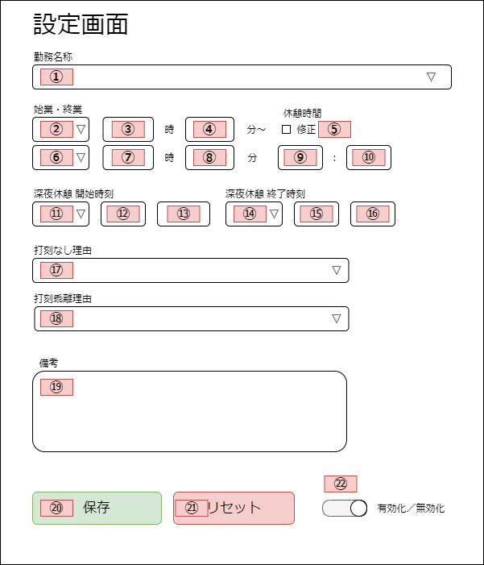

# 基本設計書

## 1. 実装方法

 Webページ上のフォームへ自動的に値を入力するにあたって、特定のWebページへのアクセス権や、ローカルストレージへのアクセスが必要となる。  
そのため、本ソフトウェアはGoogleChromeの拡張コンポーネントを使って、GoogleChromeの拡張機能として実装することとする。  

GoogleChromeの拡張コンポーネントや機能については、公式のドキュメントを参照することとする。  

> https://developer.chrome.com/extensions/devguide

## 2. 画面設計

### 2-1. 設定画面

以下はWeb打刻自動入力システムの設定画面となる。  
直感的に使用できるよう、実際の勤務実績入力画面に基づいて作成する。  

### 2-2. 設定画面のDOM要素

|No |名称                    |DOM要素           |子要素                   |
|:-:|:-----------------------|:-----------------|:------------------------|
|1  |勤務名称                |セレクトボックス  |8.0H_09:00-18:00         |
|   |                        |                  |欠勤8.0H                 |
|   |                        |                  |欠勤（労災）8.0H         |
|   |                        |                  |不就労                   |
|   |                        |                  |半消化                   |
|2  |始業日                  |セレクトボックス  |前日                     |
|   |                        |                  |当日                     |
|   |                        |                  |翌日                     |
|3  |始業（時）              |テキストボックス  |                         |
|4  |始業（分）              |テキストボックス  |                         |
|5  |休憩時間修正            |チェックボックス  |                         |
|6  |終業日                  |セレクトボックス  |前日                     |
|   |                        |                  |当日                     |
|   |                        |                  |翌日                     |
|7  |終業（時）              |テキストボックス  |                         |
|8  |終業（分）              |テキストボックス  |                         |
|9  |休憩（時）              |テキストボックス  |                         |
|10 |休憩（分）              |テキストボックス  |                         |
|11 |深夜休憩開始日          |セレクトボックス  |前日                     |
|   |                        |                  |当日                     |
|   |                        |                  |翌日                     |
|   |                        |                  |--                       |
|12 |深夜休憩開始（時）      |セレクトボックス  |00                       |
|   |                        |                  |01                       |
|   |                        |                  |02                       |
|   |                        |                  |03                       |
|   |                        |                  |︙(※省略)                |
|   |                        |                  |22                       |
|   |                        |                  |23                       |
|   |                        |                  |--                       |
|13 |深夜休憩開始（分）      |セレクトボックス  |00                       |
|   |                        |                  |05                       |
|   |                        |                  |10                       |
|   |                        |                  |︙(※省略)                |
|   |                        |                  |50                       |
|   |                        |                  |55                       |
|   |                        |                  |--                       |
|14 |深夜休憩終了日          |セレクトボックス  |前日                     |
|   |                        |                  |当日                     |
|   |                        |                  |翌日                     |
|   |                        |                  |--                       |
|15 |深夜休憩終了（時）      |セレクトボックス  |00                       |
|   |                        |                  |01                       |
|   |                        |                  |02                       |
|   |                        |                  |03                       |
|   |                        |                  |︙(※省略)                |
|   |                        |                  |22                       |
|   |                        |                  |23                       |
|   |                        |                  |--                       |
|16 |深夜休憩終了（分）      |セレクトボックス  |00                       |
|   |                        |                  |05                       |
|   |                        |                  |10                       |
|   |                        |                  |︙(※省略)                |
|   |                        |                  |50                       |
|   |                        |                  |55                       |
|   |                        |                  |--                       |
|17 |打刻なし理由            |セレクトボックス  |---------[選 択]---------|
|   |                        |                  |出勤時打刻漏れ           |
|   |                        |                  |退勤時打刻漏れ           |
|   |                        |                  |出・退勤時打刻漏れ       |
|   |                        |                  |直行・直帰               |
|   |                        |                  |直行                     |
|   |                        |                  |直帰                     |
|   |                        |                  |出張                     |
|   |                        |                  |システム停止時間         |
|18 |打刻乖離理由            |セレクトボックス  |---------[選 択]---------|
|   |                        |                  |私用・自己啓発等         |
|   |                        |                  |理由を備考欄に記載       |
|   |                        |                  |打刻誤り                 |
|19 |備考                    |テキストエリア    |                         |
|20 |保存ボタン              |ボタン            |                         |
|21 |リセットボタン          |ボタン            |                         |
|22 |自動入力有効無効切り替え|チェックボックス  |                         |

## 3. データ設計

### 3-1. ローカルストレージ

自動入力させたい値を保存するために、HTML5から導入されたAPIである、  
「LocalStorage（ローカルストレージ）」を使用することとする。

### 3-2. DOM要素と紐づくローカルストレージのデータ構造

|No |名称                    |Key       |子要素                   |Value     |
|:-:|:-----------------------|:---------|:------------------------|:---------|
|1  |勤務名称                |KNMCDS    |8.0H_09:00-18:00         ||
|   |                        |          |欠勤8.0H                 ||
|   |                        |          |欠勤（労災）8.0H         ||
|   |                        |          |不就労                   ||
|   |                        |          |半消化                   ||
|2  |始業日                  |          |前日                     ||
|   |                        |          |当日                     ||
|   |                        |          |翌日                     ||
|3  |始業（時）              |          |                         ||
|4  |始業（分）              |          |                         ||
|5  |休憩時間修正            |          |                         ||
|6  |終業日                  |          |前日                     ||
|   |                        |          |当日                     ||
|   |                        |          |翌日                     ||
|7  |終業（時）              |          |                         ||
|8  |終業（分）              |          |                         ||
|9  |休憩（時）              |          |                         ||
|10 |休憩（分）              |          |                         ||
|11 |深夜休憩開始日          |          |前日                     ||
|   |                        |          |当日                     ||
|   |                        |          |翌日                     ||
|   |                        |          |--                       ||
|12 |深夜休憩開始（時）      |          |00                       ||
|   |                        |          |01                       ||
|   |                        |          |02                       ||
|   |                        |          |03                       ||
|   |                        |          |︙(※省略)                ||
|   |                        |          |22                       ||
|   |                        |          |23                       ||
|   |                        |          |--                       ||
|13 |深夜休憩開始（分）      |          |00                       ||
|   |                        |          |05                       ||
|   |                        |          |10                       ||
|   |                        |          |︙(※省略)                ||
|   |                        |          |50                       ||
|   |                        |          |55                       ||
|   |                        |          |--                       ||
|14 |深夜休憩終了日          |          |前日                     ||
|   |                        |          |当日                     ||
|   |                        |          |翌日                     ||
|   |                        |          |--                       ||
|15 |深夜休憩終了（時）      |          |00                       ||
|   |                        |          |01                       ||
|   |                        |          |02                       ||
|   |                        |          |03                       ||
|   |                        |          |︙(※省略)                ||
|   |                        |          |22                       ||
|   |                        |          |23                       ||
|   |                        |          |--                       ||
|16 |深夜休憩終了（分）      |          |00                       ||
|   |                        |          |05                       ||
|   |                        |          |10                       ||
|   |                        |          |︙(※省略)                ||
|   |                        |          |50                       ||
|   |                        |          |55                       ||
|   |                        |          |--                       ||
|17 |打刻なし理由            |          |---------[選 択]---------||
|   |                        |          |出勤時打刻漏れ           ||
|   |                        |          |退勤時打刻漏れ           ||
|   |                        |          |出・退勤時打刻漏れ       ||
|   |                        |          |直行・直帰               ||
|   |                        |          |直行                     ||
|   |                        |          |直帰                     ||
|   |                        |          |出張                     ||
|   |                        |          |システム停止時間         ||
|18 |打刻乖離理由            |          |---------[選 択]---------||
|   |                        |          |私用・自己啓発等         ||
|   |                        |          |理由を備考欄に記載       ||
|   |                        |          |打刻誤り                 ||
|19 |備考                    |          |                         ||
|20 |保存ボタン              |          |                         ||
|21 |リセットボタン          |          |                         ||
|22 |自動入力有効無効切り替え|          |                         ||

### 3-3. データフロー

## 機能設計

### 自動入力機能 

+ 処理内容
+ 必要なデータ
+ 取得元
+ ユーザ操作

### 自動入力値の設定保存機能

+ 処理内容
+ 必要なデータ
+ 取得元
+ ユーザ操作

### 自動入力値の設定クリア機能

+ 処理内容
+ 必要なデータ
+ 取得元
+ ユーザ操作

### 自動入力の有効化／無効化の切り替え機能

+ 処理内容
+ 必要なデータ
+ 取得元
+ ユーザ操作

****