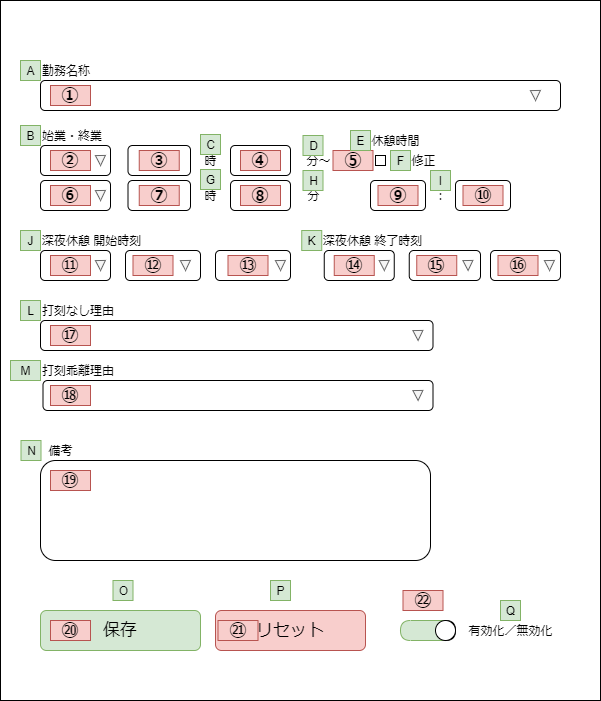

# 単体テスト仕様書

本ドキュメントは、「Web打刻自動入力システム」のテスト計画を行う。

## 目次

- [単体テスト仕様書](#単体テスト仕様書)
  - [目次](#目次)
  - [1. テスト開始前に実施すること](#1-テスト開始前に実施すること)
  - [2. 単体テスト](#2-単体テスト)
    - [2-1. 起動テスト](#2-1-起動テスト)
    - [2-2. 設定画面項目確認テスト](#2-2-設定画面項目確認テスト)
    - [2-3. ローカルストレージKey名確認テスト](#2-3-ローカルストレージkey名確認テスト)
    - [設定項目入力テスト](#設定項目入力テスト)

## 1. テスト開始前に実施すること

- GoogleChromeのインストール
- 本システム「Web打刻自動入力システム」のインストール

## 2. 単体テスト

### 2-1. 起動テスト

設定画面が起動するか確認を実施する。

| No | 対象画面 | 対象項目               | 操作                           | 想定される結果     | テスト結果 | 備考 |
|:--:|:---------|:-----------------------|:-------------------------------|:-------------------|:----------:|:-----|
|  1 |          |本システムの歯車アイコン| 本システムのアイコンをクリック | 設定画面が起動する |            |      |

### 2-2. 設定画面項目確認テスト

設定画面の各種ラベル、設計書通りに実装か確認を実施する。
なお、「対象項目」は以下の表と照らし合わせて確認を実施することとする。

| No | 対象画面 | 対象項目 | 操作 | 想定される結果              | テスト結果 | 備考 |
|:--:|:---------|:---------|:-----|:----------------------------|:----------:|:-----|
|    |設定画面  | A        | なし | 「勤務名称」と表示          |            |      |
|    |設定画面  | B        | なし | 「始業・終業」と表示        |            |      |
|    |設定画面  | C        | なし | 「時」と表示                |            |      |
|    |設定画面  | D        | なし | 「分～」と表示              |            |      |
|    |設定画面  | E        | なし | 「休憩時間」と表示          |            |      |
|    |設定画面  | F        | なし | 「修正」と表示              |            |      |
|    |設定画面  | G        | なし | 「時」と表示                |            |      |
|    |設定画面  | H        | なし | 「分」と表示                |            |      |
|    |設定画面  | I        | なし | 「：」と表示                |            |      |
|    |設定画面  | J        | なし | 「深夜休憩 開始時刻」と表示 |            |      |
|    |設定画面  | K        | なし | 「深夜休憩 終了時刻」と表示 |            |      |
|    |設定画面  | L        | なし | 「打刻なし理由」と表示      |            |      |
|    |設定画面  | M        | なし | 「打刻乖離理由」と表示      |            |      |
|    |設定画面  | N        | なし | 「備考」と表示              |            |      |
|    |設定画面  | O        | なし | 「保存」と表示              |            |      |
|    |設定画面  | P        | なし | 「リセット」と表示          |            |      |
|    |設定画面  | Q        | なし | 「有効化／無効化」と表示    |            |      |
|    |設定画面  | ①        | なし | セレクトボックスが表示      |            |      |
|    |設定画面  | ②        | なし | セレクトボックスが表示      |            |      |
|    |設定画面  | ③        | なし | テキストボックスが表示      |            |      |
|    |設定画面  | ④        | なし | テキストボックスが表示      |            |      |
|    |設定画面  | ⑤        | なし | チェックボックスが表示      |            |      |
|    |設定画面  | ⑥        | なし | セレクトボックスが表示      |            |      |
|    |設定画面  | ⑦        | なし | テキストボックスが表示      |            |      |
|    |設定画面  | ⑧        | なし | テキストボックスが表示      |            |      |
|    |設定画面  | ⑨        | なし | テキストボックスが表示      |            |      |
|    |設定画面  | ⑩        | なし | テキストボックスが表示      |            |      |
|    |設定画面  | ⑪        | なし | セレクトボックスが表示      |            |      |
|    |設定画面  | ⑫        | なし | セレクトボックスが表示      |            |      |
|    |設定画面  | ⑬        | なし | セレクトボックスが表示      |            |      |
|    |設定画面  | ⑭        | なし | セレクトボックスが表示      |            |      |
|    |設定画面  | ⑮        | なし | セレクトボックスが表示      |            |      |
|    |設定画面  | ⑯        | なし | セレクトボックスが表示      |            |      |
|    |設定画面  | ⑰        | なし | セレクトボックスが表示      |            |      |
|    |設定画面  | ⑱        | なし | セレクトボックスが表示      |            |      |
|    |設定画面  | ⑲        | なし | テキストエリアが表示        |            |      |
|    |設定画面  | ⑳        | なし | ボタンが表示                |            |      |
|    |設定画面  | ㉑       | なし | ボタンが表示                |            |      |
|    |設定画面  | ㉒       | なし | スイッチが表示              |            |      |

### 2-3. ローカルストレージKey名確認テスト

### 設定項目入力テスト